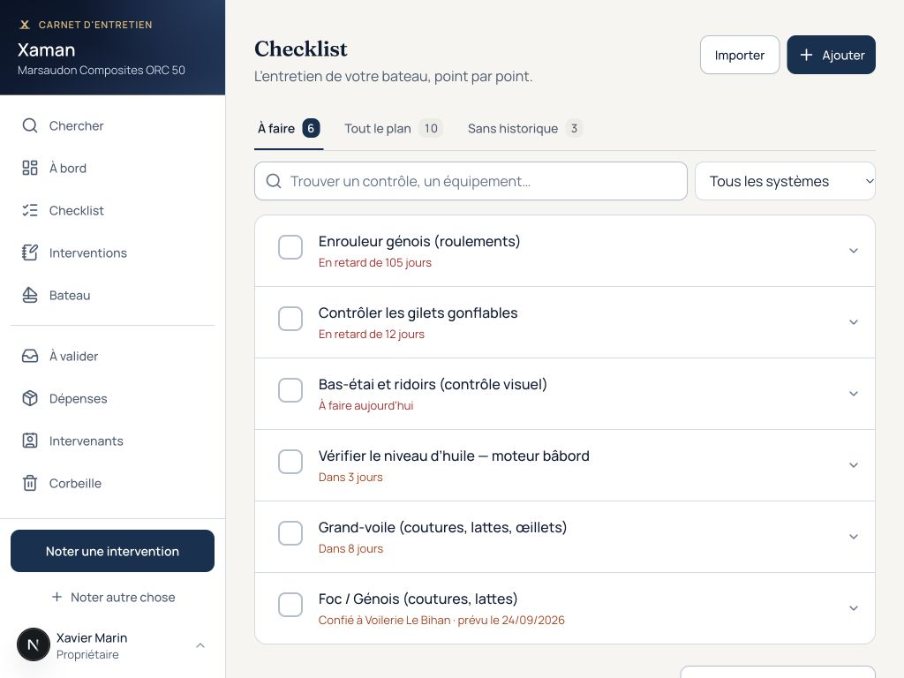
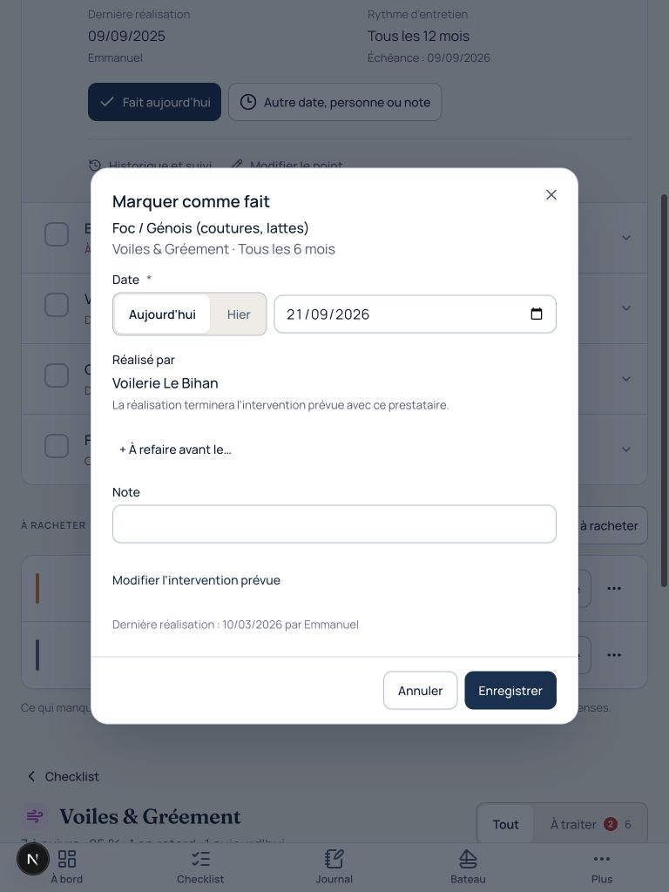

# Checklist — audit et reprise E4-13

Audit du 21 septembre 2026, après la première refonte E4-12. La cible est Xavier sur
son iPad à bord et Emmanuel sur téléphone : trouver le contrôle, lire sa méthode,
le réaliser, puis garder une trace fiable dans le carnet.

## Problèmes corrigés

| Constat | Conséquence | Comportement livré |
|---|---|---|
| La première refonte surchargeait chaque ligne et plaçait un pourcentage global en tête | Les contrôles passaient après les indicateurs | Lignes compactes, échéance lisible, consignes et historique dépliables |
| Les blocs par catégorie imposaient une lecture système par système | Un contrôle urgent pouvait se retrouver après des contrôles moins urgents d'un autre système | Une liste continue, ordonnée par urgence dans « À faire » ; système disponible en filtre et dans le détail |
| « Jamais noté » était mélangé aux travaux à traiter | L'absence d'historique devenait une fausse urgence | Vues « À faire », « Tout le plan » et « Sans historique » distinctes |
| Cocher ouvrait systématiquement un formulaire | Trop de manipulations pour une opération quotidienne | Un appui note aujourd'hui et la personne connectée ; date, auteur et note restent modifiables dans le détail |
| Le contrôle pouvait quitter la liste après enregistrement | Perte du point de repère sous le doigt | La ligne garde sa place jusqu'au changement de filtre, avec confirmation et annulation |
| Un ancien relevé moteur pouvait être réutilisé sans confirmation | Des heures anciennes pouvaient être présentées comme actuelles | Le cochage demande le compteur lorsque le dernier relevé n'est pas d'aujourd'hui |
| Le rechargement d'un contrôle ouvert lisait ses étapes différemment sur serveur et navigateur | Erreur d'hydratation et interaction perdue | Restauration des étapes via un store local compatible SSR |
| Une intervention confiée affichait « Moi » dans le dialogue | Intervenant affiché différent de celui réellement conservé | Prestataire de la fiche affiché ; modification et réalisation utilisent la même intervention |
| Le retrait d'un travail confié annonçait sa réouverture, alors qu'il allait à la corbeille | Confirmation trompeuse | Action nommée « Mettre à la corbeille » pour cette fiche existante ; annulation simple pour un nouveau cochage |

Les statuts restent calculés par la vue SQL. Aucun schéma ni droit d'accès modifié.
Une échéance fixe et une intervention ouverte demandent une confirmation détaillée.
Une réalisation ancienne ne remplace pas artificiellement une réalisation plus récente.
Le stock manquant reste après les contrôles ; son bloc vide disparaît.

## Recette dans le navigateur

Composants réels inspectés dans Chrome à 1024 × 768, 768 × 1024, 390 × 844 et
320 × 740. Ce sont des formats iPad et téléphone, pas une certification Safari sur matériel.

- Recherche et filtres combinés, changement de système, retour à la liste complète.
- Consignes et étapes sur place ; fermeture, réouverture et rechargement avec étapes cochées.
- Refus d'enregistrement : retour à l'état initial et conservation des étapes en cours.
- Réalisation détaillée, annulation du formulaire et intervention confiée avec son prestataire.
- Aucun débordement horizontal constaté ; cibles de cochage de 48 × 48 px.
- Les actions de gestion de la galerie reproduisent celles de la page réelle.

## Parcours automatisés

`tests/e2e/journeys/checklist-work.spec.ts` utilise la vraie pile Auth/PostgREST/Postgres
isolée de CI, avec utilisateurs et données de recette. Aucun test n'écrit dans le carnet de production.

1. Double appui : une seule intervention, ligne stable, annulation, nouveau cochage puis persistance au rechargement.
2. Étapes conservées au rechargement sans erreur d'hydratation ; réalisation à une date passée avec note puis annulation confirmée en base.
3. Compteur moteur ancien : heures demandées, refus de saisie vide, enregistrement du relevé saisi.
4. Point sans historique : absence dans les urgences, recherche et système conservés au rechargement.
5. Lecteur : accès aux consignes, aucune action de réalisation.
6. Intervention confiée : prestataire conservé, même identifiant d'intervention, aucun doublon ; retrait explicitement nommé.

Les parcours existants vérifient aussi l'ajout d'un point et son cochage depuis la racine.
La suite unitaire couvre la distinction historique/échéances, la priorité des urgences,
les relevés périmés, les échéances fixes et les retours serveur/annulations.

La [validation CI du code livré](https://github.com/myfrank-io/xaman/actions/runs/35630549231)
réussit : **1 035 tests métier/RLS, 270 contrôles tactiles et 34 parcours avec Supabase**,
ainsi que lint, format, TypeScript et build. Les parcours sont ignorés dans le job tactile
sans Supabase, puis exécutés intégralement dans leur job avec la base.

Des avertissements d'hydratation de la navigation partagée (Breadcrumbs/BottomTabs) restent
visibles dans les logs CI, sans échec des parcours. La reprise des étapes de la checklist
dispose de son propre contrôle d'absence d'erreur d'hydratation.

Les résultats sont attachés à la [PR #99](https://github.com/myfrank-io/xaman/pull/99).
La recette physique Safari/iPad et la validation d'usage par Xavier restent à faire.

## E4-14 — Catégories et documents, 22 septembre 2026

Un point possède plusieurs catégories et un seul historique. Les catégories principales/secondaires suivent les filtres, la progression et les interventions issues du point. Une fonction Postgres enregistre point + catégories dans une transaction avec RLS et contrôle de version.

Les deux formulaires présentent les photos/documents en tête, trois commandes de même largeur, une grille de catégories et des champs alignés en haut. Leur barre d’actions suit les bords des champs. Pas de clavier forcé à l’ouverture. Le transfert d’un fichier bloque l’enregistrement jusqu’à sa fin ; un échec de rattachement conserve les fichiers pour réessayer.

Vérifications locales : migration complète + seed sur Postgres 17 isolé avec le shim Supabase du dépôt ; tests métier/RLS ; lint, types, build Next et service worker. Recette visuelle navigateur en 1024×768 et 768×1024, sans débordement horizontal ; actions de 44 px alignées. Ces captures ne valent pas une recette sur iPad physique.

- `checklist-form-landscape-e4-14.png`
- `checklist-form-portrait-e4-14.png`
- `intervention-form-landscape-e4-14.png`
- `intervention-form-portrait-e4-14.png`

Parcours automatisés ajoutés : création avec deux catégories et PDF, visibilité sous les deux filtres, relecture et modification, conservation du fichier après rechargement ; upload refusé sans perte du formulaire ; intervention avec document dans le bloc commun. La CI les exécute sur sa propre stack Supabase, jamais sur Xaman en production.

Déploiement : appliquer `20260922081718_checklist_categories_and_documents.sql` avant de déployer le code. Migration additive, compatible avec la version précédente. Ne pas servir le nouveau formulaire avec l’ancien schéma.
